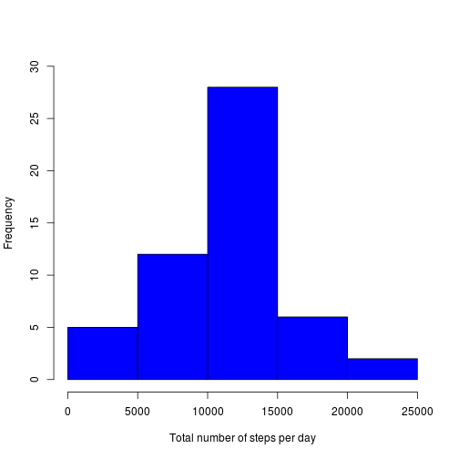
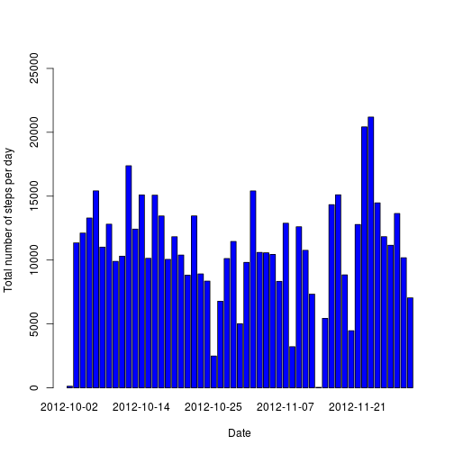
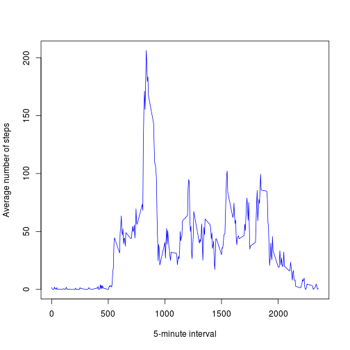
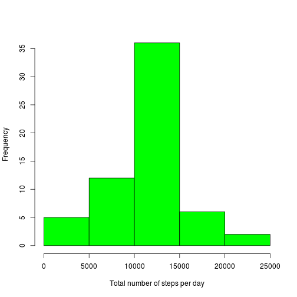
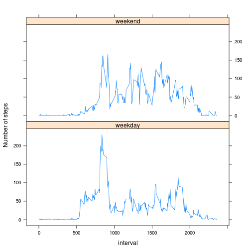

# Reproducible Research: Peer Assessment 1

## Loading and preprocessing the data


```r
file <- "activity.csv"
unzip("activity.zip", files = file)
activity <- read.csv(file)
str(activity)
```

```
## 'data.frame':	17568 obs. of  3 variables:
##  $ steps   : int  NA NA NA NA NA NA NA NA NA NA ...
##  $ date    : Factor w/ 61 levels "2012-10-01","2012-10-02",..: 1 1 1 1 1 1 1 1 1 1 ...
##  $ interval: int  0 5 10 15 20 25 30 35 40 45 ...
```

```r
summary(activity)
```

```
##      steps               date          interval   
##  Min.   :  0.0   2012-10-01:  288   Min.   :   0  
##  1st Qu.:  0.0   2012-10-02:  288   1st Qu.: 589  
##  Median :  0.0   2012-10-03:  288   Median :1178  
##  Mean   : 37.4   2012-10-04:  288   Mean   :1178  
##  3rd Qu.: 12.0   2012-10-05:  288   3rd Qu.:1766  
##  Max.   :806.0   2012-10-06:  288   Max.   :2355  
##  NA's   :2304    (Other)   :15840
```


## What is mean total number of steps taken per day?

For this part of the assignment, you can ignore the missing values in the dataset.


**1. Make a histogram of the total number of steps taken each day.**

```r
stepsDay <- aggregate(steps ~ date, activity, sum)
hist(stepsDay$steps, main="", xlab="Total number of steps per day",col="blue", ylim=c(0,30))
```

 

Here, there is another way to do it by using *barplot*.


```r
barplot(stepsDay$steps, names.arg = stepsDay$date, col = "blue", main = "",
       xlab="Date",ylab="Total number of steps per day", ylim=c(0,max(stepsDay$steps+5000)))
```

 

**2. Calculate and report the mean and median total number of steps taken per day.**

```r
m <- mean(stepsDay$steps, na.rm=TRUE)
md <- median(stepsDay$steps, na.rm=TRUE)
```

*The mean total number of steps taken per day.*

```
## [1] 10766
```
*The median total number of steps taken per day.*

```
## [1] 10765
```

## What is the average daily activity pattern?

**1. Make a time series plot (i.e. type = "l") of the 5-minute interval (x-axis) and the average number of steps taken, averaged across all days (y-axis).**


```r
intervalSteps <-aggregate(steps ~ interval, activity, mean)
names(intervalSteps)[2] <- "meanSteps"
plot(intervalSteps, col="blue", type = "l", xlab="5-minute interval",
     ylab="Average number of steps")
```

 

**2. Which 5-minute interval, on average across all the days in the dataset, contains the maximum number of steps?**


```r
subset(intervalSteps, meanSteps == max(meanSteps), select=c(interval,meanSteps))
```

```
##     interval meanSteps
## 104      835     206.2
```

## Imputing missing values

Note that there are a number of days/intervals where there are missing values (coded as NA). The presence of missing days may introduce bias into some calculations or summaries of the data.


**1. Calculate and report the total number of missing values in the dataset (i.e. the total number of rows with NAs).**
 

```r
sum(is.na(activity$steps))
```

```
## [1] 2304
```

**2. Devise a strategy for filling in all of the missing values in the dataset. The strategy does not need to be sophisticated. For example, you could use the mean/median for that day, or the mean for that 5-minute interval, etc.**

*I will use the mean for that 5-minute interval for filling in all of the missing values in the dataset.*


```r
activity2 <- activity # Copy the original data
intervalSteps <-aggregate(steps ~ interval, activity, mean) # Create the interval and mean steps in a data frame 
names(intervalSteps)[2] <- "meanSteps"  # Rename de column to clarify
for(i in 1:nrow(activity2)) # Loop to sweep the data to find NA and to replace with the correponding mean
{ if (is.na(activity2[i,"steps"]))
    activity2[i,"steps"] <-subset(intervalSteps,interval == activity2[i,"interval"], select=c("meanSteps"))
}
```

**3. Create a new dataset that is equal to the original dataset but with the 
missing data filled in.**

*Summary of new data with imputting missing values.*


```r
# activity2 is the new dataset
str(activity2)
```

```
## 'data.frame':	17568 obs. of  3 variables:
##  $ steps   : num  1.717 0.3396 0.1321 0.1509 0.0755 ...
##  $ date    : Factor w/ 61 levels "2012-10-01","2012-10-02",..: 1 1 1 1 1 1 1 1 1 1 ...
##  $ interval: int  0 5 10 15 20 25 30 35 40 45 ...
```

```r
summary(activity2)
```

```
##      steps               date          interval   
##  Min.   :  0.0   2012-10-01:  288   Min.   :   0  
##  1st Qu.:  0.0   2012-10-02:  288   1st Qu.: 589  
##  Median :  0.0   2012-10-03:  288   Median :1178  
##  Mean   : 37.4   2012-10-04:  288   Mean   :1178  
##  3rd Qu.: 27.0   2012-10-05:  288   3rd Qu.:1766  
##  Max.   :806.0   2012-10-06:  288   Max.   :2355  
##                  (Other)   :15840
```

**4. Make a histogram of the total number of steps taken each day and Calculate and report the mean and median total number of steps taken per day.**


```r
stepsDay2 <- aggregate(steps ~ date, activity2, sum)
hist(stepsDay2$steps, main="", xlab="Total number of steps per day",col="green")
```

 


```r
m2 <- mean(stepsDay2$steps)
md2 <- median(stepsDay2$steps)
```

*The mean total number of steps taken per day.*

```
## [1] 10766
```

*The median total number of steps taken per day.*

```
## [1] 10766
```

*Do these values differ from the estimates from the first part of the assignment?*
*What is the impact of imputing missing data on the estimates of the total daily number of steps?*


```
##    mean median
## 1 10766  10765
## 2 10766  10766
```
*Due to imputing missing values, the media remains its value and the median increases slightly.*


## Are there differences in activity patterns between weekdays and weekends?

For this part the weekdays() function may be of some help here. Use the dataset
with the filled-in missing values for this part.

**1. Create a new factor variable in the dataset with two levels – “weekday” and “weekend” indicating whether a given date is a weekday or weekend day.**


```r
# Change date variable from factor to date type
activity2$date <- as.Date(activity2$date, "%Y-%m-%d")
# Transform date values to day names
days <- weekdays(activity2$date)
# Create a vector to save weekend or weekday words
dayType <- vector()
# Loop to classify dates
for(i in 1:nrow(activity2)){
   if ((days[i] == "sábado") || (days[i] == "domingo"))
      dayType[i] <- "weekend"
   else if ((days[i] == "Saturday") || (days[i] == "Sunday"))
      dayType[i] <- "weekend"
   else
      dayType[i] <- "weekday"
}
# Create a new column with day type vector values
activity2$dayType <- dayType
# Convert dayType as factor
activity2$dayType <- as.factor(dayType)
# Summary of new data
str(activity2)
```

```
## 'data.frame':	17568 obs. of  4 variables:
##  $ steps   : num  1.717 0.3396 0.1321 0.1509 0.0755 ...
##  $ date    : Date, format: "2012-10-01" "2012-10-01" ...
##  $ interval: int  0 5 10 15 20 25 30 35 40 45 ...
##  $ dayType : Factor w/ 2 levels "weekday","weekend": 1 1 1 1 1 1 1 1 1 1 ...
```

```r
head(activity2)
```

```
##     steps       date interval dayType
## 1 1.71698 2012-10-01        0 weekday
## 2 0.33962 2012-10-01        5 weekday
## 3 0.13208 2012-10-01       10 weekday
## 4 0.15094 2012-10-01       15 weekday
## 5 0.07547 2012-10-01       20 weekday
## 6 2.09434 2012-10-01       25 weekday
```

**2. Make a panel plot containing a time series plot (i.e. type = "l") of the 5-minute interval (x-axis) and the average number of steps taken, averaged across all weekday days or weekend days (y-axis).**


```r
activity3 <- aggregate(activity2$steps,by=list(interval=activity2$interval,
                       activity2$dayType), mean)
names(activity3)[2] <- "dayType"
names(activity3)[3] <- "meanSteps"
library(lattice)
xyplot(meanSteps ~ interval | dayType, data=activity3, type ="l", 
       layout = c(1,2),ylab="Number of steps")
```

 

